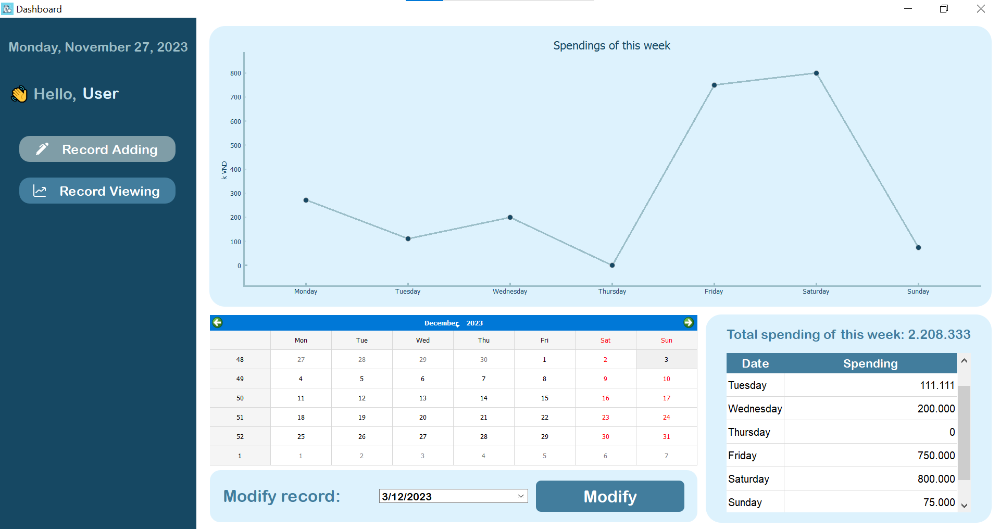

# Daily Expense Desktop Application

Daily Expense application for desktop using PyQt5 and PyQtGraph.

## Main UI
- Login UI
- Dashboard UI (Edit/View)
- Record Modifying UI

## To-do
- [ ] Add Gif/Videos
- [ ] Add ThreadingPool for PyQt5
- [ ] Connect with a database instead of the csv file
- [ ] Apply Docker
